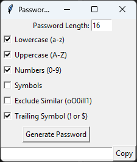

# Password Generator GUI

Simple Tkinter-based desktop password generator with configurable options and one-click copy.



## Features

- Set password length (default: 16)
- Toggle character sets:
  - Lowercase letters (`a-z`)
  - Uppercase letters (`A-Z`)
  - Numbers (`0-9`)
  - Symbols (`string.punctuation`)
- Exclude visually similar characters: `o O 0 i I l 1`
- Exclude ambiguous punctuation characters like `{ } [ ] ( ) / \ ' " \` ~ , ; : . < >`
- Optional trailing symbol (appends one of `! $ @ # % ^ & *`)
- Copy generated password to clipboard

## Usage

### Requirements

- Python 3.x
- `pyperclip` for clipboard support:

```bash
pip install -r requirements.txt
